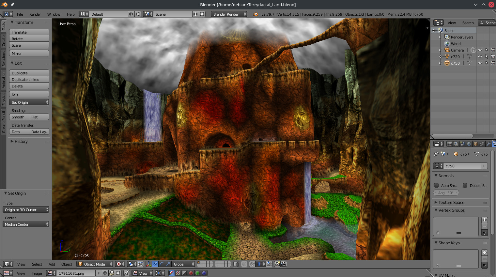

# Wumba's Wigwam

Modified source adding proper vertex color and UV output for import into Blender using [io_scene_obj_rgba](https://github.com/RareExports/io_scene_obj_rgba).

Special thanks to [@Zeldaboy14](https://github.com/Zeldaboy14) and [@SpiceyWolf](https://github.com/SpiceyWolf).

|                                    |
| ------------------------------------------------------------------- |
| *Pictured: Terrydactyland from Banjo Tooie imported into Blender.*  |

